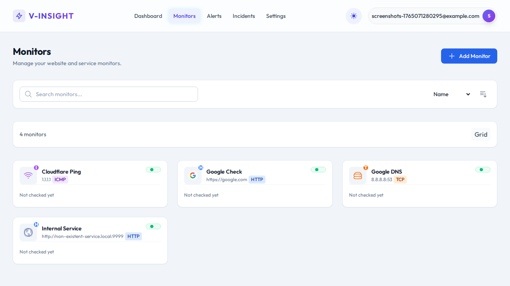
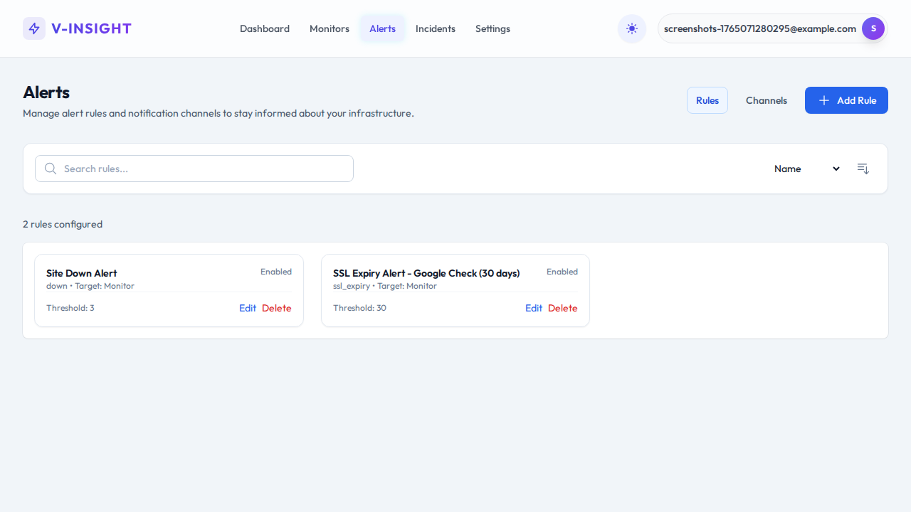
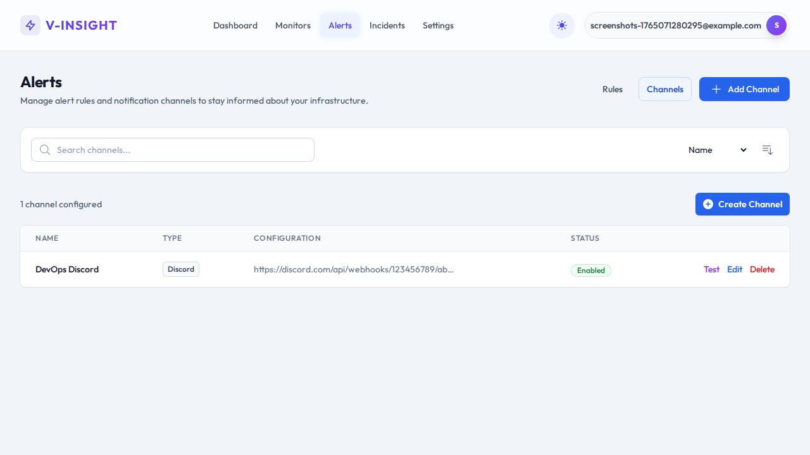
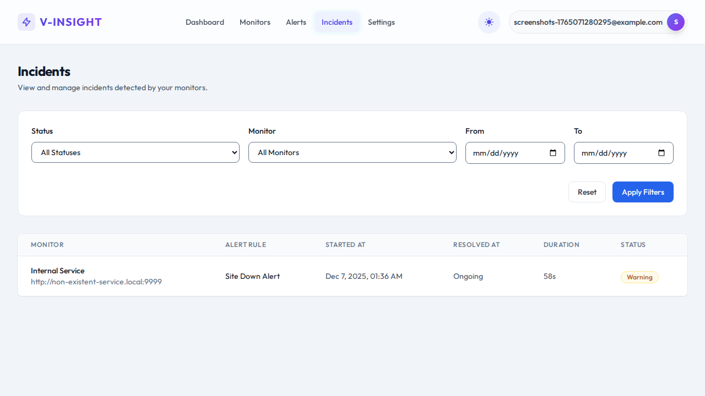

# V-Insight — Monitoring SaaS

V-Insight is a Docker-based monitoring platform with a focus on reliability and observability. It includes an API backend, background worker jobs, and a SvelteKit frontend with a CORS-free API proxy.

- Backend: Go, Gin (port 8080)
- Worker: Go (port 8081)
- Frontend: SvelteKit (port 3000)
- Database: PostgreSQL 15
- Shared: Go module for domain entities and repositories

---

## Quick overview

V-Insight performs automated health checks (HTTP/HTTPS) and SSL expiry monitoring, evaluates alert rules, creates incidents, and notifies configured channels (webhook, Discord, email-ready).

It supports user isolation via `user_id` on all main tables and enforces user-scoped queries consistently in handlers and repositories.

**Architecture Refactoring:** The project now uses a **Go Workspace** (`go.work`) with a `shared` module to centralize domain logic and repositories, reducing duplication between Backend and Worker services.

---

## Key features

- HTTP/HTTPS health checks, uptime and response time tracking
- SSL certificate expiry checks
- Flexible alert rules (down, slow_response, ssl_expiry)
- Incident lifecycle with automatic resolution
- Notification channels: webhook, Discord, (email-ready)
- Docker-first developer workflow and automatic DB migrations

---

## Screenshots

### Monitors


### Alert Rules


### Alert Channels


### Incidents


---

## Quick start (development)

```bash
git clone https://github.com/eovipmak/v-insight.git
cd v-insight
cp .env.example .env
make up
```

Or without `make`:

```bash
docker compose up -d
```

- Backend: http://localhost:8080
- Frontend: http://localhost:3000
- Swagger API: http://localhost:8080/swagger/

Migrations run automatically on startup.

---

## For developers and contributors

This project uses Go Workspaces.

- **Setup Workspace**: `go work sync`
- **Shared Module**: `shared/` contains entities and repositories.
- **Backend**: `backend/` contains API handlers and services.
- **Worker**: `worker/` contains background jobs.

Tests:
- Shared: `cd shared && go test ./...`
- Backend: `cd backend && go test ./...`
- Worker: `cd worker && go test ./...`
- Frontend: `cd frontend && npm run check` (TypeScript), `npx playwright test` (E2E)

Tips:
- Do not commit `.env` files to the repository – use environment configurations for production.
- Use `make` convenience commands (`make up`, `make logs`, `make rebuild`, `make migrate-up`, etc.)

---

## For AI agents and automations

To make it easier for LLMs, bots, or automation agents to work in this repo, see `docs/ai_agents.md`. Key notes:

- API proxy: `frontend/src/routes/api/[...path]/+server.ts` — **do NOT** add CORS middleware.
- User Isolation: Always include and verify `user_id` context when querying or modifying user-scoped resources.
- Migrations: Located in `backend/migrations/` — use `make migrate-create` then edit up/down SQL files; run `make migrate-up`.
- Tests: Backend/Worker use Go tests. Ensure tests pass before opening PRs.

---

## Docs

Detailed documentation: `docs/` includes guides for architecture, configuration, installation, usage, troubleshooting, contributing, and AI agent guidelines.

---

## License

This project is licensed under the MIT License — see `LICENSE` for details.
